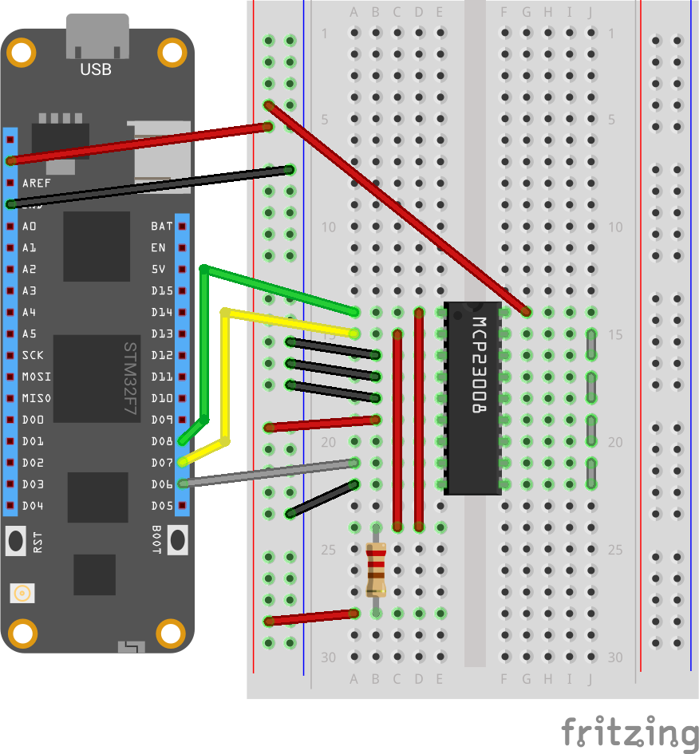

# `Tests.Mcp23x08` Test Assembly

This test assembly is for testing the MCP23x08 IO Expander Peripheral.

> NOTE: This test is a work-in-progress.
> NOTE1: The 5k pull-ups are required (there's wiggle-room in the value, but 5k works and I had them on-hand)
 
## GPIO/Interrupt Tests 



(This really needs a graphical diagram)

```
        Meadow          MCP 
                        Pxx == physical pin
                        GPx == logical I/O
        ----------------------------------------
+-----> 3V3       <---> VDD (P18)
|       GND       <---> VSS (P09)
+--5kΩ- D07 (SDA) <---> P02
+--5kΩ- D08 (SCK) <---> P01
        D06 (INT) <---  P08
                        A1  (P04)   <--> VSS (P09)
                        A0  (P05)   <--> VSS (P09)
                        RESET (P06) <--> VDD (P18)
                        GP0 (P10)   <--> GP1 (P11)
                        GP2 (P12)   <--> GP3 (P13)
                        GP4 (P14)   <--> GP5 (P15)
                        GP6 (P16)   <--> GP7 (P17)
```
