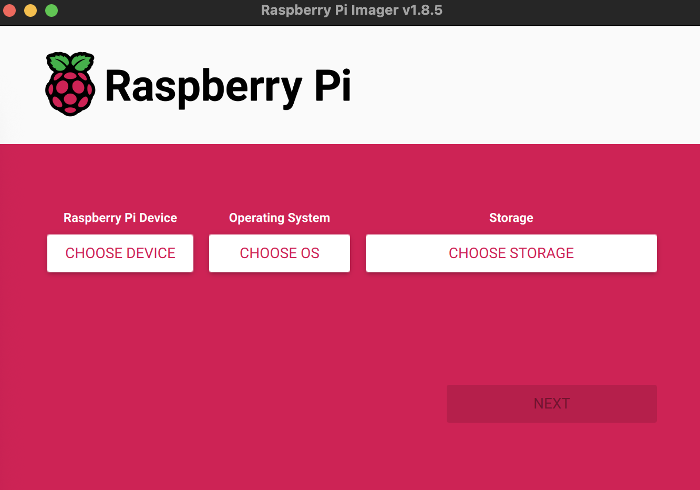
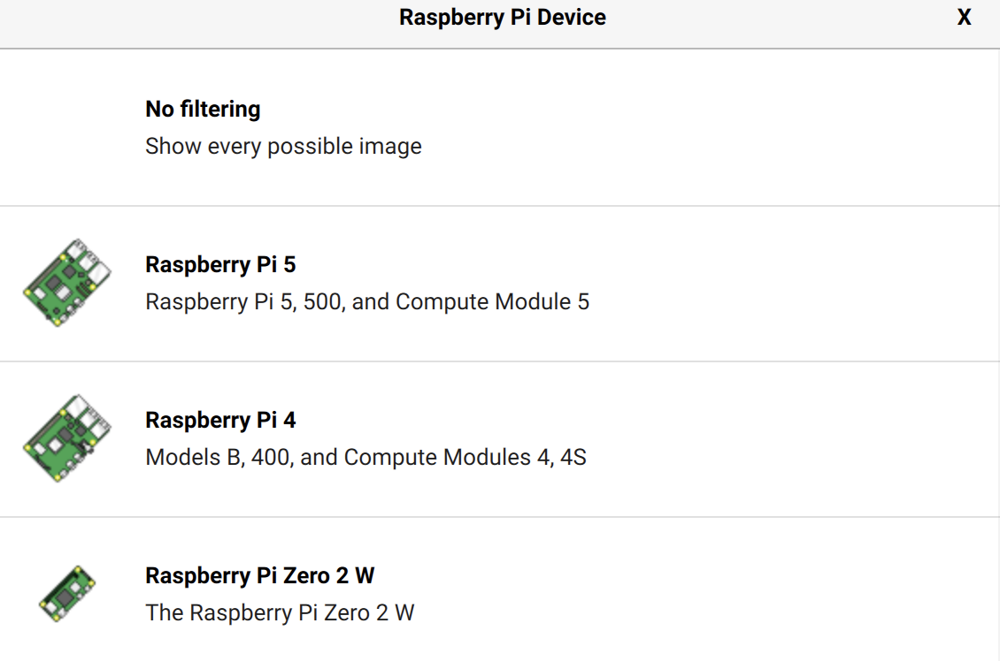
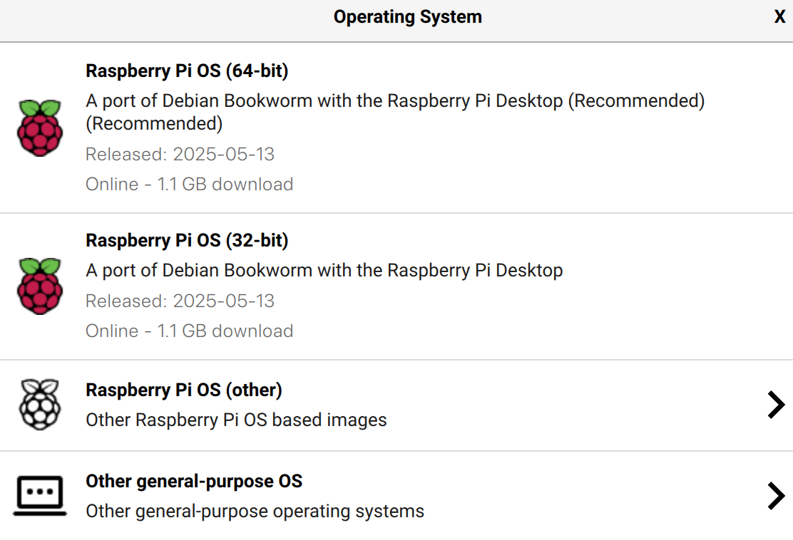
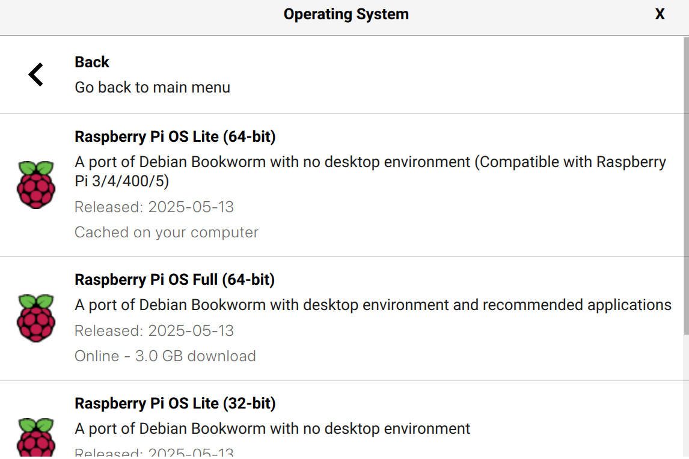
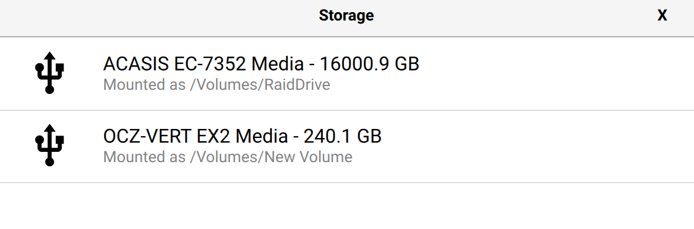
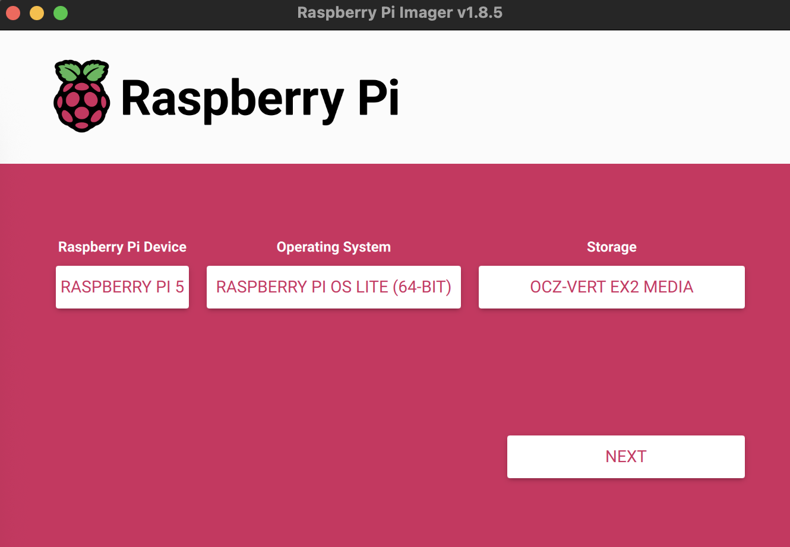
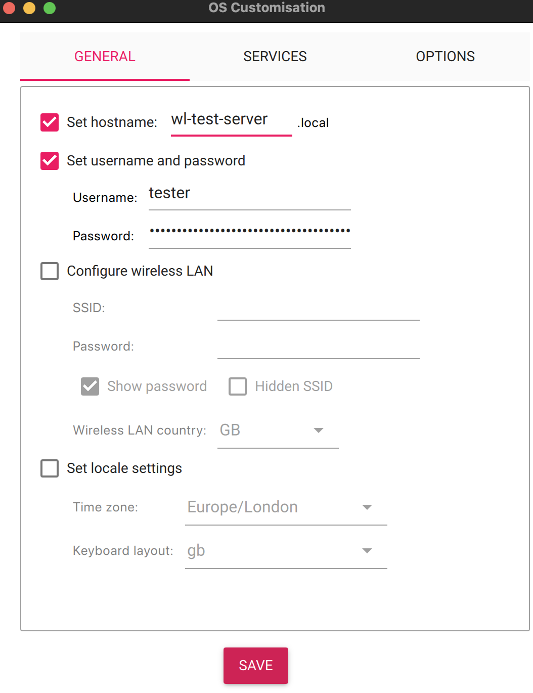
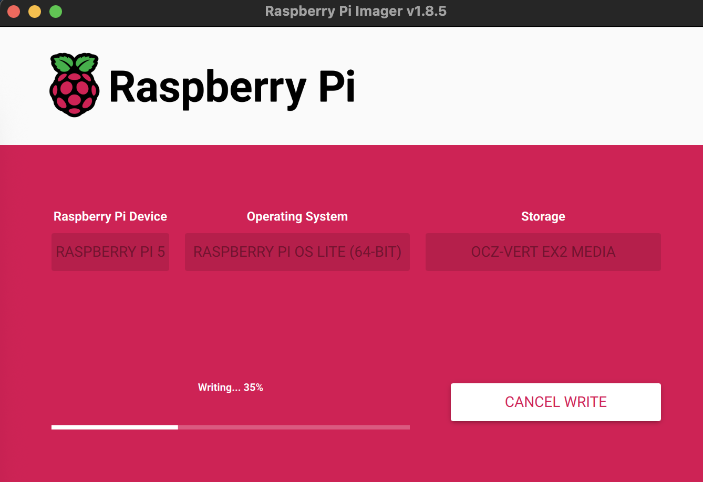
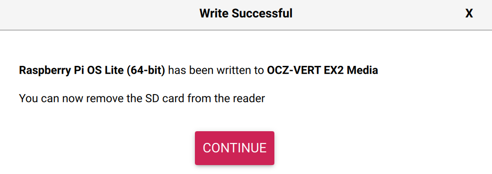

# Raspberry Pi Operating System Preparation

At the end of this guide the Raspberry Pi should be configured as follows:

* Server name: wl-test-server
* User name: tester
* Password: testerspassword

The Raspberry Pi should have a basic (lite) operating system installed.  Network connectivity will be over Ethernet.

Note that any of these parameters can be changed and WiFi added to the configuration during the installation process.

## Installing Raspberry Pi Lite

Installation of the operating system is performed by the [Raspberry Pi Imager](http://raspberrypi.com/software/) software from Raspberry Pi.  The destination for the operating system can be an SD Card or SATA drive.

### Connect the Drive (SD Card) and Start Raspberry Pi Imager

Upon starting the Raspberry Pi Imager software you will be presented with a screen asking you to:

* Select the device (Raspberry Pi model)
* Select the operating system to be deployed
* Select the storage medium for the operating system



In this case a Raspberry Pi 5 is being used:



### Select Operating System

This device is going to be used as a test server and so there is little need to install a full operating system as the device can be run headless.  To do this select _Raspberry Pi OS (other):



Selecting _other_ will present alternative versions of the operating system.  In the case of the Raspberry Pi 5 the 64-bit versions of the operating system should be used.  In this case the _Raspberry Pi OS Lite (64-bit)_ is the right choice for a headless installation.



### Select the Media

Next up the destination media should be identified.  In this case the destination is a 240 GB SSD:



The next start is to start to customise the operating system configuration by pressing the _Next_ button.



### Settings

Pressing the _Edit Setting_ button will give the option of configuring the operating system:


The _OS Customisation_ window will allow the device name, user account and password to be edited.  The default for this repository

* Host (server) name: wl-test-server
* User name: tester
* Password: testerspassword



Note that alternative names can be used and these should be noted and the _hosts.ini_ file modified accordingly.

From here, select _Save_ and then _Yes_ on the _Use OS Customisation_ window.

A new window should now be presented warning that the media will be erased and all previous data stored will be lost.


The application will start to write the operating system to the media and finally apply the custom configuration:



The application should finally confirm that the media has been updated:



## Logging on to the Raspberry Pi

Ansible requires a SSH connection to the Raspberry Pi in order to execute the actions is the Ansible scripts.  It further requires the SSH key for the device to be stored locally.  This is achieved with the following three steps:

### Log on to the Raspberry Pi

Execute the following command:

```bash
ssh tester@wl-test-server.local
```

The Raspberry Pi will ask for the password for the _tester_ account:

```
The authenticity of host 'wl-test-server.local (fe80::64b:a060:3465:ff7b%en0)' can't be established.
ED25519 key fingerprint is SHA256:6Xd+aj3wkkNlfJycLlDG5d6x2/j/lRjXCs9KQaF8vRQ.
This key is not known by any other names.
Are you sure you want to continue connecting (yes/no/[fingerprint])? yes
Warning: Permanently added 'wl-test-server.local' (ED25519) to the list of known hosts.
tester@wl-test-server.local's password:
```

Next simply log off the Raspberry Pi by issuing the `exit` command

```
The programs included with the Debian GNU/Linux system are free software;
the exact distribution terms for each program are described in the
individual files in /usr/share/doc/*/copyright.

Debian GNU/Linux comes with ABSOLUTELY NO WARRANTY, to the extent
permitted by applicable law.

Wi-Fi is currently blocked by rfkill.
Use raspi-config to set the country before use.

tester@wl-test-server:~ $ exit
exit
Connection to wl-test-server.local closed.
```

### Store the `ssh` Key Locally

Execute the following command on the local machine:

```bash
ssh-copy-id tester@wl-test-server.local
```

This command copies the `ssh` key from the Raspberry and stores the key locally.  Note that the _tester` users password is required to complete this.  If successful then something like the following will be displayed:

```
/usr/bin/ssh-copy-id: INFO: Source of key(s) to be installed: ssh-add -L
/usr/bin/ssh-copy-id: INFO: attempting to log in with the new key(s), to filter out any that are already installed
/usr/bin/ssh-copy-id: INFO: 1 key(s) remain to be installed -- if you are prompted now it is to install the new keys
tester@wl-test-server.local's password:

Number of key(s) added:        1

Now try logging into the machine, with: "ssh 'tester@wl-test-server.local'"
and check to make sure that only the key(s) you wanted were added
```

### Check the Connection

The final step is to check the connection to the Raspberry Pi and the local key storage.  This is done by executing the following command:

```bash
ssh tester@wl-test-server.local
```

This time, the login process should not ask for the _tester_ users password and you should be taken straight through to the Raspberry Pi `bash` prompt.

```
The programs included with the Debian GNU/Linux system are free software;
the exact distribution terms for each program are described in the
individual files in /usr/share/doc/*/copyright.

Debian GNU/Linux comes with ABSOLUTELY NO WARRANTY, to the extent
permitted by applicable law.

Wi-Fi is currently blocked by rfkill.
Use raspi-config to set the country before use.
```

The system should now be able to be configured using Ansible.
